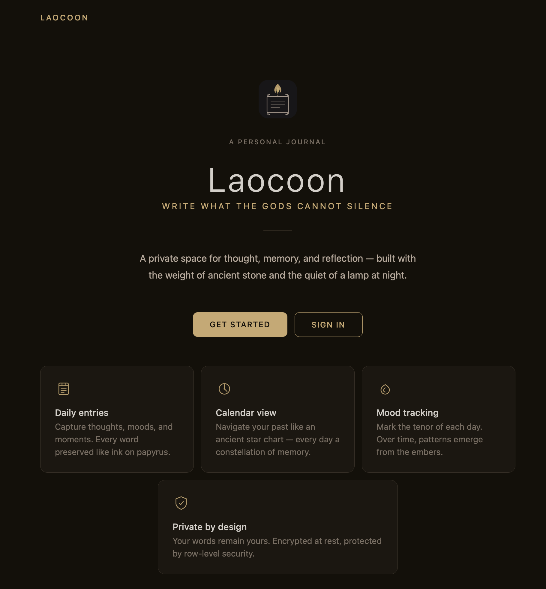
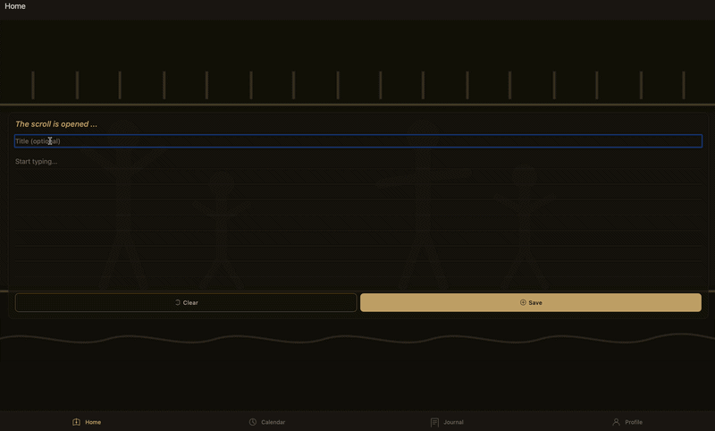
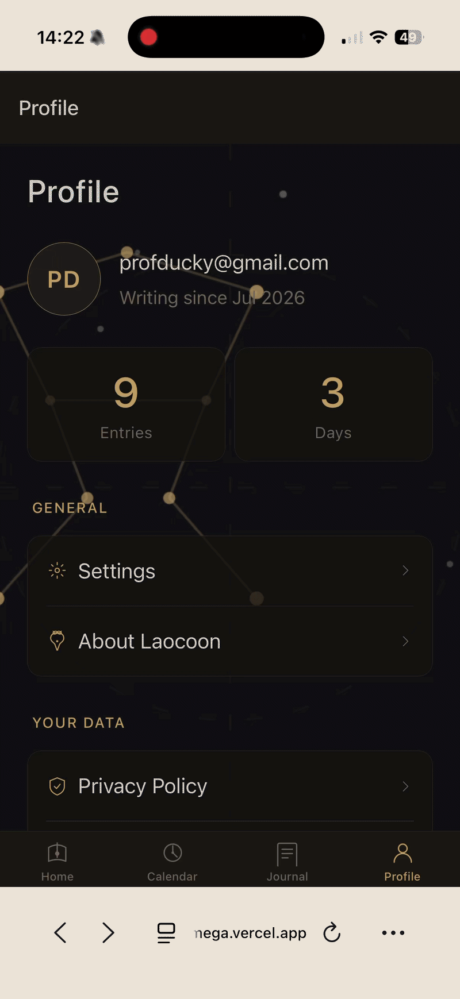

# 📘 LAOCOON — The Flame & The Scroll

[](#)
[](#)
[](#)
[](#)


> *Your mind is an oracle. Not the kind that speaks in riddles—the kind that speaks only when you listen.*

A personal journaling app built for long-term self-reflection. Write daily, look back across any point in time, and watch the shape of your own thinking emerge. Track the days across years.

---
## 🎬 Preview

<table>
  <tr>
    <td align="center">
      <br>
      <sub><b>Welcome</b></sub>
    </td>
    <td align="center">
      <br>
      <sub><b>Writing an entry</b></sub>
    </td>
    <td align="center">
      <br>
      <sub><b>Profile</b></sub>
    </td>
  </tr>
</table>

---


## 🌐 Live Demo

👉 https://www.laocoon.app
---

## 💡 Concept

Laocoon is a private space to record what matters. Each day you write — your thoughts, your clarity, your confusion. No audience. No rules.

But the real value comes later: return to any day, any year, and read the voice of who you were then. Watch patterns repeat. Measure the distance. Understand your own becoming.

The app is named for the Trojan priest Laocoon — a man who saw clearly when no one else would listen. This is built for that kind of clarity: not for being heard by the world, but for hearing *yourself*.

---

## 📱 Screens

| Screen | Purpose |
|---|---|
| **Home** | Daily writing field — lined card, clear + save |
| **Journal** | Entry list and history |
| **Calendar** | Navigate any month/year, see days with entries highlighted, tap to preview |
| **Profile** | User profile: sign out, delete, downlaod data |
| **Settings** | App preferences: theme, languge, font size |
| **About** | App philosophy and story |
| **Privacy Policy** | App philosophy and story |

---

## ⚙️ Tech Stack

- **React Native** + **Expo** (file-based routing via Expo Router)
- **TypeScript**
- Supabase
- Custom design system in `styles/theme.ts` — dark ancient-world palette (gold/bronze accents, stone/ash text)

---

## 🏁 Getting Started

```bash
npm install
npx expo start
```

Opens options to run on:
- iOS simulator
- Android emulator
- Web browser
- Expo Go (physical device)

> **More about project setup and gettign started here : [setup](docs/setup-tutorial.md)**
---

## 🏗️ Architecture

```
   ┌────────────────────────────────────────────────────┐
   │                Expo App                            │
   │  (iOS / Android / Web bundle via react-native-web) │
   └────────────────────────┬───────────────────────────┘
                            │
                @supabase/supabase-js
                            │
   ┌────────────────────────▼───────────────────────────┐
   │                    Supabase                        │
   │   Auth (email + password, recovery, sessions)      │
   │   Postgres  (entries, user_profiles)               │
   │   Row-level security (auth.uid() = owner)          │
   │   Triggers (updated_at, handle_new_user)           │
   └────────────────────────────────────────────────────┘
```

* Web: Expo exports a static bundle to `dist/` via `npm run build:web` (`expo export --platform web`).

> **More about app  architecture and components here: [Architecture](docs/architecture-spec.md#Architecture)**

---

## 📂 Project Architecture

```
laocoon/
├── app/                        # Expo Router — file-based routes
│   ├── _layout.tsx             # Root Stack + AuthGate + PreferencesProvider
│   ├── welcome.tsx             # Public landing page (first stop for visitors)
│   ├── privacy.tsx             # Privacy Policy (public)
│   ├── update-password.tsx     # Post–reset-email password change (public)
│   ├── settings.tsx            # Theme, font size, default day view
│   ├── about.tsx               # App philosophy and story
│   ├── (auth)/                 # Unauthenticated stack
│   │   ├── _layout.tsx         #   Themed Stack navigator
│   │   ├── sign-in.tsx         #   Email + password login
│   │   ├── sign-up.tsx         #   Email + password + consent
│   │   └── reset.tsx           #   "Forgot password?" form
│   └── (tabs)/                 # Authenticated tab bar
│       ├── _layout.tsx         #   Tabs: Home · Calendar · Journal · Profile
│       ├── index.tsx           #   Home — daily writing surface
│       ├── calendar.tsx        #   Calendar grid + "On this day" toggle
│       ├── journal.tsx         #   Entry list · inline edit · delete
│       └── profile.tsx         #   Avatar · stats · nav · export · delete · sign out
├── assets/
│   ├── app-icons/              # App icon variants (multiple resolutions)
│   ├── cards/                  # Dark-theme background card images
│   ├── cards-light/            # Light-theme background card images
│   ├── icons/                  # Custom SVG icon library
│   └── splash/                 # Splash screen assets
├── components/
│   └── AppText.tsx             # Font-size-scaling `Text` wrapper
├── docs/
│   ├── laocoon-spec.md         # Living architecture reference
│   ├── setup_tutorial.md       # Local dev + Vercel deploy tutorial
│   ├── about.md                # Draft copy for the About page
│   └── db/
│       └── supabase-setup.sql  # Idempotent DB setup (tables, RLS, triggers)
├── lib/
│   ├── supabase.ts             # Supabase client + platform storage adapter
│   ├── session.tsx             # Session context and hook
│   ├── entries.ts              # Entry CRUD helpers
│   ├── preferences.tsx         # Prefs context (theme / font / default view)
│   └── legal.ts                # PRIVACY_POLICY_VERSION + effective date
├── styles/
│   ├── theme.ts                # Dark palette + `useTheme()` + card asset registry
│   └── themeLight.ts           # Light palette bundle
├── vercel.json                 # Vercel build config with SPA rewrite
└── package.json
```

> **More about project architecture and structure here: [Client architecture](docs/laocoon-spec.md#client-architecture)**

---

## 🔥 Features

### Writing & reflection
* **Daily entries** — title (optional) + free-form text, saved to your account.
* **Journal history** — list every entry you've written, edit in place, or delete.
* **Calendar view** — see the whole month at a glance; days with entries are highlighted and badged with the count.
* **"On this day"** — retrospective view of what you wrote on the same day across previous years.
* **Tap any day** — opens a centered modal with each entry for that day, timestamped.

### Personalisation
* **Dark / Light / System themes** — full palette swap, live. System follows your OS setting.
* **Font size** — Small / Default / Large, applied across every screen via a text wrapper.
* **Default day view** — pick whether the Calendar tab opens on the grid or on "On this day".
* **Local persistence** — preferences survive reload on web (localStorage) and app kill on native (AsyncStorage).

### Auth & account
* **Email + password sign-up** with a Privacy Policy consent checkbox (not pre-checked).
* **Forgot password** flow — reset link by email, land on a dedicated screen to set a new one.
* **Sign out** and **delete my account** from Profile.
* **Session persistence** across reloads.

### Privacy & data
* **Row-level security** in Postgres — users can only ever read or write their own rows.
* **EU-hosted data** (Supabase Frankfurt) for GDPR compliance.
* **Privacy Policy page** with semver versioning + human-readable effective date.
* **Export my data** — one-click JSON download of every entry (web).
* **Delete my account** — cascade-wipes your entries and flags the auth record for removal.
* **No trackers, no analytics cookies** — nothing beyond what's needed to keep you signed in.

### Cross-platform
* **One codebase** ships to iOS, Android, and the web via Expo + `react-native-web`.
* **Deep links** work: hard-loading `/settings` or `/privacy` resolves on Vercel via SPA rewrite.
* **Themed native headers** on pushed pages (About / Settings / Privacy) with a proper back button.


---

## 🧠 Future Improvements

* 🗣️ Multi-language support
* 😱 Text-emotion detection

---

## 👨‍💻 Author

**Pavlo Mospan(c) 2026**.

* 💼 Data Scientist / AI Engineer
* 🌍 Augsburg, Germany

---

## ⭐️ Show your support

If you like this project:

* ⭐️ Star the repo
* 🍴 Fork it
* 🧠 Share ideas
---

*Your thoughts. Your timeline. Your truth.*
